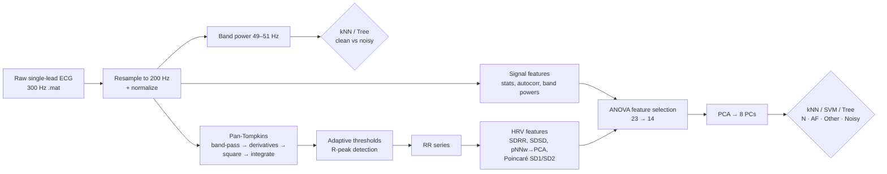

# ECG Signal Classification

**A from-scratch MATLAB pipeline for single-lead ECG analysis: noise screening, a hand-built Pan-Tompkins R-peak detector, 14 HRV/morphology features, and kNN/tree classifiers for Normal, Atrial Fibrillation, Other rhythm, and Noisy recordings.**

## Overview

Atrial fibrillation (AF) is the most common sustained arrhythmia and a major stroke risk factor. Spotting it automatically in short single-lead ECGs (the kind wearables and portable monitors record) is a core digital-health problem. A standard way to do it is to detect R peaks and look at heart-rate variability (HRV), since AF causes irregular RR intervals. In practice, the problem is harder because:

- recordings can be **corrupted by noise** (power-line interference, motion), which must be rejected before diagnosis;
- the R-peak detector must work on signals of **varying length, amplitude and quality**;
- "Other rhythm" recordings overlap heavily with both normal and AF ones.

This project covers the whole chain, from raw signal to class label, in MATLAB. It was an individual project for the *Biomedical Signals and Instrumentation* course (Biomedical Engineering, Universitat de Barcelona, December 2022).

## What I built

- **Clean-vs-noisy screening (Goal 1).** I inspected the spectra with periodograms and found that noisy recordings carry clear power around **50 Hz**. I used band power in 49–51 Hz as a single feature, after resampling 300 → 200 Hz, amplitude normalization and z-scoring. With it I trained a kNN classifier (Chebyshev distance, k = 17) and a classification tree (MinLeafSize = 78) on 8,528 clean + 4,999 noisy recordings.
- **My own Pan-Tompkins QRS detector (Goal 2).** I implemented every stage myself:
  - band-pass filtering with low-pass and high-pass difference equations;
  - first- and second-derivative filters, combined as `1.3·d1 + 1.1·d2`;
  - squaring and an 8-sample moving-window integrator;
  - fiducial-peak search with a 200 ms refractory distance;
  - adaptive signal/noise thresholds (`THR1 = NPK + 0.25·(SPK − NPK)`, `THR2 = 0.5·THR1`, with running updates `SPK/NPK = 0.125·peak + 0.875·SPK/NPK`) and search-back for missed beats;
  - a plausibility flag (`pks_ok`) based on the mean RR distance.
- **Feature engineering (23 candidate features screened by ANOVA).** From both the raw ECG and the RR series:
  - **ECG signal:** mean, standard deviation, outlier fraction; autocorrelation mean, std and max; band powers in 0.5–5, 5–15, 15–30 and 30–45 Hz.
  - **Peak counts:** number of peaks and the `pks_ok` flag.
  - **RR series:** mean RR, SDRR (HRV), SDSD, RR outlier fraction, cross-correlation of consecutive beat lengths.
  - **pNN family:** pNN20 and pNN50, plus a **pNNw sweep (w = 10…200 ms, 20 features)** compressed with PCA into 3 components.
  - **Poincaré plot:** SD1, SD2 and tilt, taken from a least-squares ellipse fit to (RRₙ, RRₙ₊₁) after outlier removal.
- **Statistical feature selection.** I ran a one-way ANOVA of each feature against the 4 rhythm labels and kept **14 features**.
- **Dimensionality reduction + classification (Goal 3).** PCA on the 14 selected features keeps **8 principal components (≥95% of variance)**. On these I trained kNN (city-block distance, k = 14), a multiclass SVM (ECOC) and a classification tree (MinLeafSize = 49), evaluated with a 70/30 hold-out split and confusion matrices.

## Pipeline



## Results

All numbers come from the project presentation (`ECGClassification_presentation.pdf`). Each is from a single random 70/30 hold-out split.

**Goal 1: clean (A) vs noisy (B), one feature (50 Hz band power)**

| Model | Hyperparameters | Accuracy | F-score | Precision A / B | Recall A / B |
|---|---|---|---|---|---|
| kNN | Chebyshev, k = 17 | 0.9556 | 0.952 | 0.957 / 0.954 | 0.973 / 0.926 |
| Classification tree | MinLeafSize = 78 | 0.957 | 0.957 | 0.964 / 0.951 | 0.970 / 0.942 |

**Goal 3: 4-class rhythm classification on 8 principal components**

| Model | Hyperparameters | Accuracy | Macro F-score |
|---|---|---|---|
| **kNN** | city-block, k = 14 | **0.7217** | **0.567** |
| Classification tree | MinLeafSize = 49 | 0.6841 | 0.528 |
| Multiclass SVM (ECOC) | defaults | very low (noted in code; not reported) | – |

Per-class precision and recall for kNN:

| Class | Precision | Recall |
|---|---|---|
| AF | 0.578 | 0.692 |
| Normal | 0.777 | 0.881 |
| Other | 0.591 | 0.425 |
| Noisy | 0.447 | 0.247 |

**Most discriminative features (ANOVA, lowest p-values):** PC1 of the pNNw sweep (p ≈ 0), PC3 (1.2e-146), PC2 (3.1e-116), ECG outlier fraction (3.6e-97), SDSD (2.3e-73), SDRR (1.2e-65), `pks_ok` (1.3e-62), Poincaré SD2 (5.5e-51).

**Takeaways:**

- 50 Hz band power alone separates clean from noisy recordings with about 96% accuracy.
- RR-irregularity features (the pNNw principal components, SDSD, SDRR, Poincaré descriptors) carry most of the rhythm information.
- Normal and AF are recognized much better than "Other" and "Noisy". This is the expected hard part of the task.

## Tech stack

- **MATLAB.** Base MATLAB, plus the Signal Processing Toolbox (`periodogram`, `bandpower`, `resample`, `findpeaks`, `xcorr`) and the Statistics and Machine Learning Toolbox (`anova1`, `pca`, `cvpartition`, `fitcknn`, `fitcecoc`, `fitctree`, `confusionchart`).
- **Signal processing:** IIR/FIR difference-equation filters, power spectral density, autocorrelation.
- **ML:** PCA, kNN, ECOC-SVM and decision trees, with hold-out validation.

## Repository structure

```
.
├── ECGClassification.m                  # Full pipeline: screening, Pan-Tompkins, features, ANOVA, PCA, classifiers
├── fit_ellipse.m                        # Least-squares ellipse fit used for Poincaré SD1/SD2/tilt (third-party utility)
├── ECG_normal/                          # 10 sample clean recordings (A00001–A00010, .mat + .hea, 300 Hz)
├── ECG_noisy/                           # 10 sample noisy recordings (B1–B10, .mat)
└── ECGClassification_presentation.pdf   # Project presentation: methods and results
```

## Getting started

1. Clone the repository and open it in MATLAB. Both toolboxes listed above are required.
   ```bash
   git clone https://github.com/sergimarsol/ECG-Signal-Classification.git
   cd ECG-Signal-Classification
   ```
2. **Data.** The repo ships only 10 + 10 sample records. The full analysis expects:
   - `training2017/`: the full set of 8,528 clean-labelled recordings (`A*.mat` / `A*.hea`, variable `val`, 300 Hz);
   - `REFERENCE.csv`: record name and label (`N`, `A`, `O`, `~`);
   - `ECG_noisy/`: the full set of 4,999 noisy recordings (variable `newval`).

   This format matches the PhysioNet/Computing in Cardiology Challenge 2017 (AF classification from short single-lead ECGs) training set.
3. Run the script section by section (`Ctrl+Enter` on each `%%` cell) or all at once:
   ```matlab
   ECGClassification
   ```
   The script prints accuracies and opens the figures: periodograms, the Pan-Tompkins stages, R-peak detection, Poincaré plots, PCA Pareto/biplot/heatmap and confusion matrices.

**Notes:**

- The first exploratory cell indexes files beyond the 20 included samples (for example `files{44}`), so it needs the full dataset.
- Array sizes (8,528 / 4,999) are hard-coded for the full dataset.
- The hold-out split is random (no fixed seed), so accuracies vary slightly between runs.

## Author and acknowledgements

- **Sergi Marsol Torrent** (individual project). Biomedical Engineering, Universitat de Barcelona. Course: *Biomedical Signals and Instrumentation*.
- `fit_ellipse.m` is a third-party least-squares ellipse-fitting utility from MATLAB File Exchange. It is included unmodified for the Poincaré-plot features.
- ECG recordings follow the PhysioNet/CinC Challenge 2017 format. Clifford et al., *"AF Classification from a Short Single Lead ECG Recording: the PhysioNet/Computing in Cardiology Challenge 2017"*, CinC 2017.

## License

Released under the [MIT License](LICENSE). The bundled `fit_ellipse.m` and any ECG data remain under their original authors' terms.
